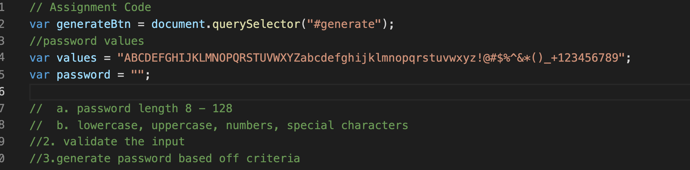
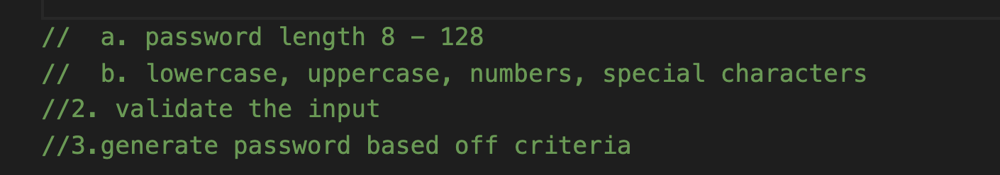
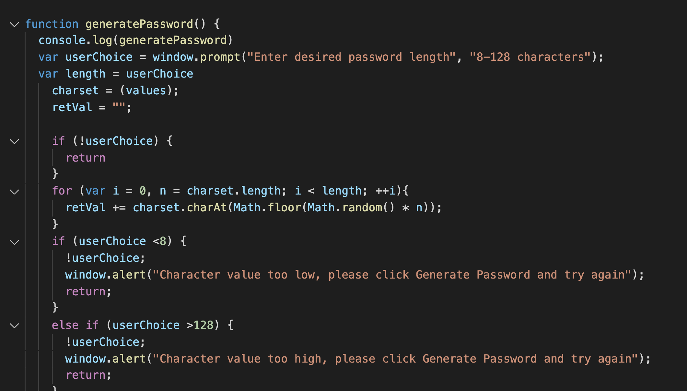
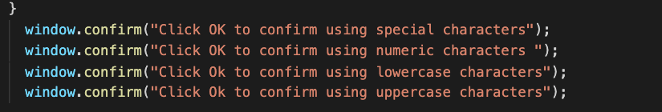
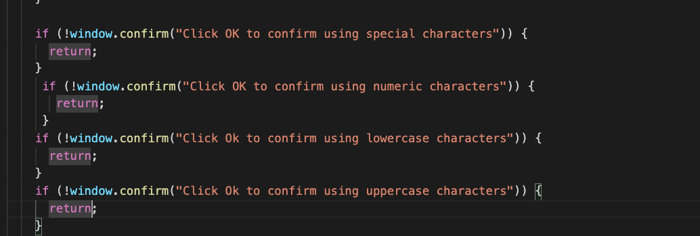

# 03 JavaScript: Password Generator

## Discribtion
  To make a password generator with appropriate acceptance criteria, by setting password length and giving lowercase, uppercase, numeric, and/or special characters. 
  Creating functions and implementing them by user choices to generate a valid password. 
  
  ## Usage 

Assigned variables and made a string to use in the function

Made a gameplan on how to get started on the problem. (approach)

## Conclusion

